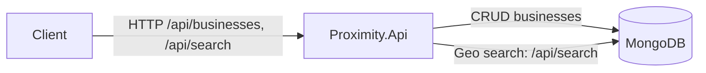
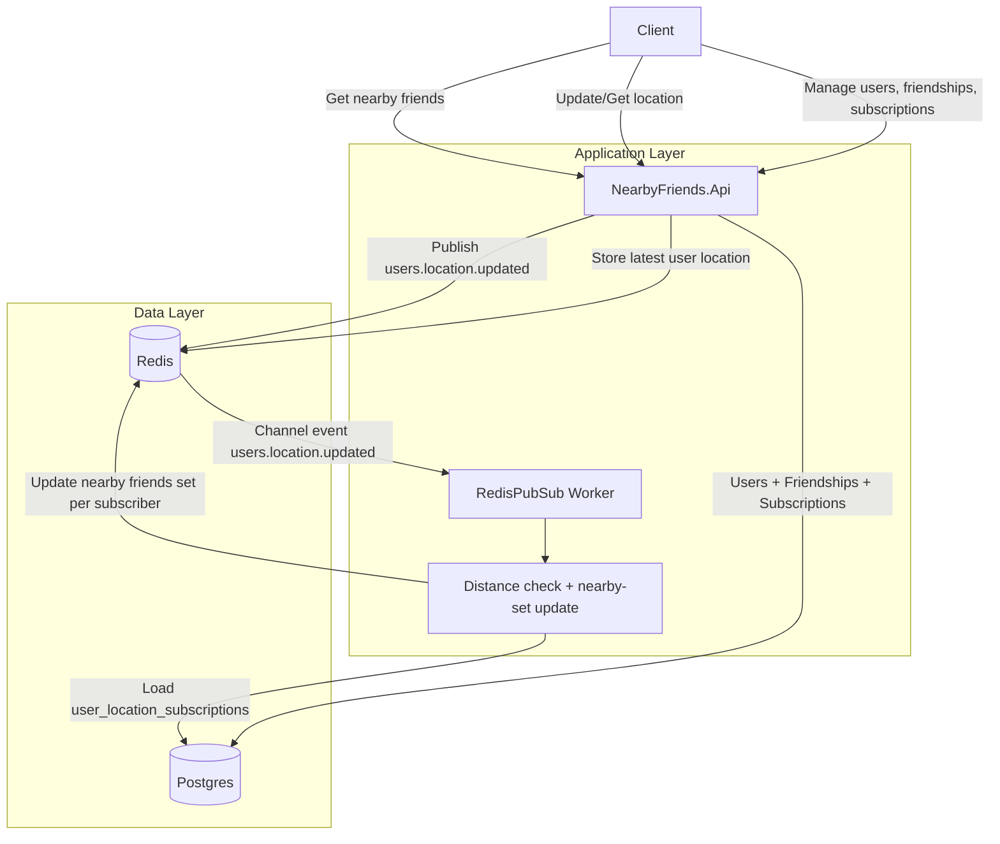

# SystemDesign

This repository contains two backend applications:

- `Proximity.Api`: geospatial business catalog/search on MongoDB.
- `NearbyFriends.Api`: users/friendships/location updates with Redis + Postgres.

It also includes:

- `RedisPubSub` worker: consumes location update events and maintains nearby-friend Redis sets.

## Services and ports

When running `compose.yaml`:

- `Proximity.Api`: `http://localhost:1000`
- `NearbyFriends.Api`: `http://localhost:1001`
- `MongoDB`: `localhost:27017`
- `Postgres`: `localhost:5432`
- `Redis`: `localhost:6379`

## Run local stack

Start everything:

```bash
docker compose up -d --build
```

Stop and remove containers:

```bash
docker compose down
```

Stop and remove containers + volumes:

```bash
docker compose down -v
```

## Proximity API

Base URL: `http://localhost:1000`

Main endpoints:

- `GET /api/health`
- `POST /api/businesses`
- `GET /api/businesses/{businessId}`
- `PUT /api/businesses/{businessId}`
- `DELETE /api/businesses/{businessId}`
- `GET /api/search?latitude={lat}&longtitude={lng}&radius={0.5km|1km|2km|5km|20km}`

Project path: `src/proximity/Proximity.Api`

### Architecture diagram



## Nearby Friends API

Base URL: `http://localhost:1001`

Main endpoints:

- `GET /api/health`
- `POST /api/users`
- `GET /api/users/{userId}`
- `PUT /api/users/{userId}`
- `DELETE /api/users/{userId}`
- `POST /api/users/{userId}/friends/{friendId}`
- `POST /api/users/{userId}/location`
- `GET /api/users/{userId}/location`
- `POST /api/users/{userId}/friends/{friendId}/location/subscriptions`
- `GET /api/users/{userId}/nearby-friends`

Project path: `src/nearbyfriends/NearbyFriends.Api`

### Architecture diagram



### Nearby-friends flow

1. Two users become friends.
2. A location subscription is created (stored bidirectionally in Postgres).
3. User location updates are published to Redis channel `users.location.updated`.
4. `RedisPubSub` consumes events, checks subscribed users and distance (`<= 2km`).
5. Nearby sets are maintained per subscriber key: `nearby:friends:{subscriberUserId}`.
6. `GET /api/users/{userId}/nearby-friends` returns nearby friend IDs for that user.

## RedisPubSub worker

Project path: `src/redispubsub/RedisPubSub`

Responsibilities:

- Subscribe to `users.location.updated`
- Read subscriptions from Postgres table `user_location_subscriptions`
- Add/remove friend IDs in subscriber-specific Redis sets based on distance

## Distributed Mongo stack (Proximity)

For the sharded Mongo setup used by `Proximity.Api`:

```bash
docker compose -f mongo/compose.distributed.yaml -f compose.distributed.yaml up -d --build
```

Tear down:

```bash
docker compose -f mongo/compose.distributed.yaml -f compose.distributed.yaml down -v
```

Notes:

- Uses `ASPNETCORE_ENVIRONMENT=Distributed` for `Proximity.Api`.
- Reads `src/proximity/Proximity.Api/appsettings.Distributed.json`.
